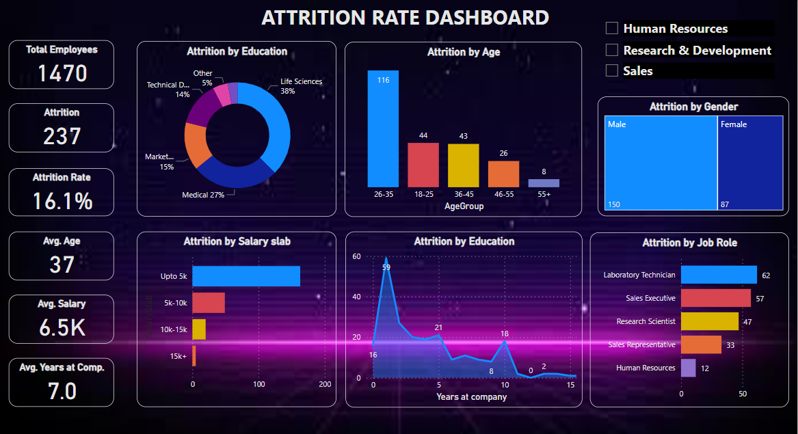
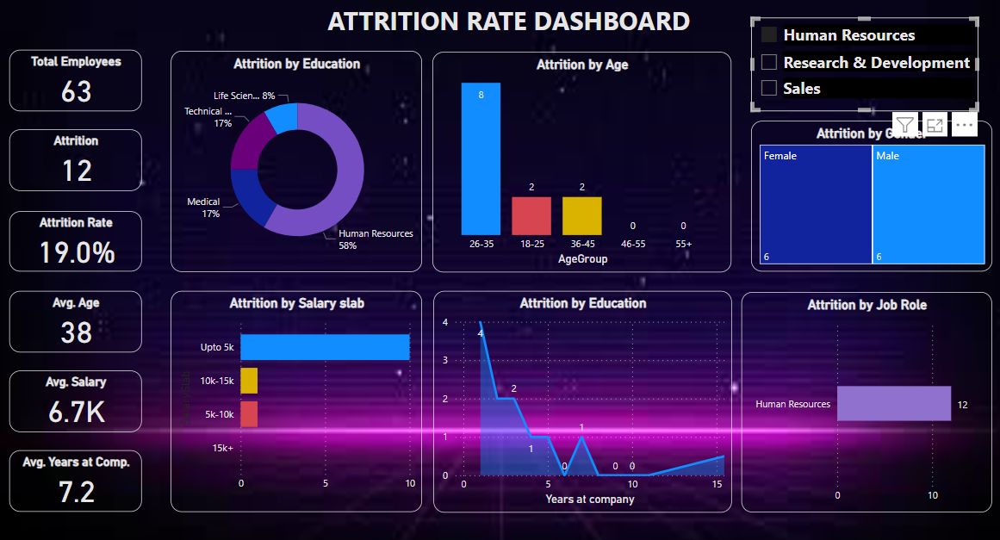
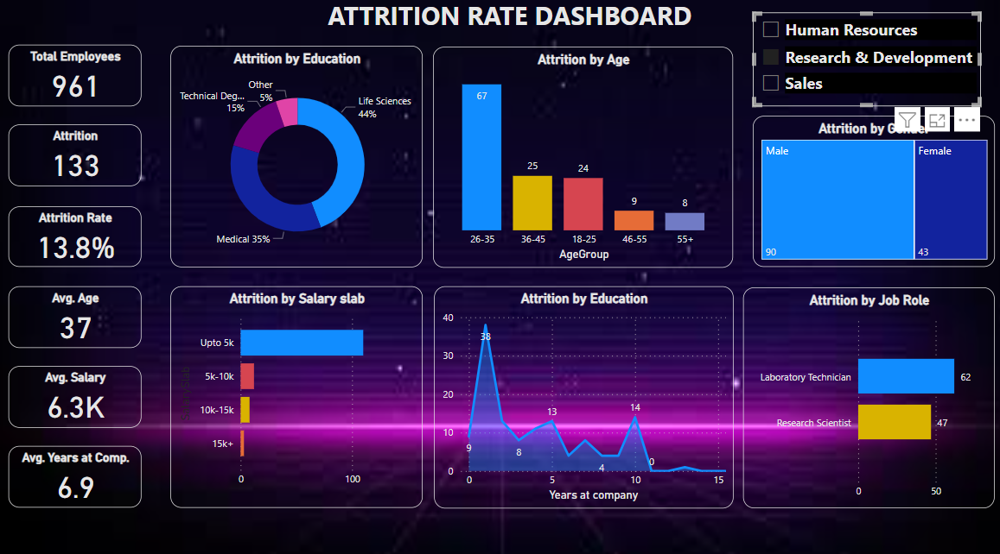
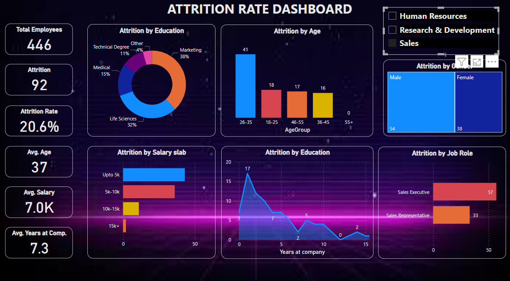

# PowerBi_Dashboard
Here is a quick look on the interactive dashboard I build on Attrition rate to help company retain their employees

Got a data in a raw format. Had leverage the use of power query editor in Power BI to transform, clean and sort the data in required format useful for further analysis and building reports and dashboard. 

which includes but not limited to 
 Merging queries 
 Adding multiple conditional columns 
 Handling null values
 Removing redundant columns
 Using delimiters to required info in seperate columns
 Validating the information and many more

Made an interactive dashboard depending on the important KPI and metrics. 

The following is a screenshot of dashboard which give a good insights on patterns and senarios for attrition in given organization.

It contains graphs based on KPI such as
 
1.Attrition by Education 
2.Attrition by Age 
3.Attrition by Salary slab 
4.Attrition by years in company (The graph in image says attrition by Education, I'll soon rename the title and upload new correct screenshot. Thanks for highlighting the error) 
5.Attrition by Job Role 
6.Attrition by gender 
 

Let's look into more details. Added a high-level slider on department. So, following are the screenshot of the dashboard based on three departments

1.Human Resources
 

2. Research and development

3.Sales
 

 Please feel free to reach out to me incase you have any queries or suggestion on dashboard
 Thank-you. 
